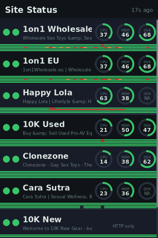

# PiPing

A site-monitoring kiosk for a Raspberry Pi with a 3.5" SPI touchscreen. Displays a scrollable grid of monitored websites — status lights, response checks, grep phrase validation, and live server gauges (CPU / memory / disk) from an optional PHP agent on each host.

Also serves a **web panel** on port 8080 so you can check status from any browser, with the same dark-theme grid, history sparklines, and screenshot thumbnails.

Push notifications via [Pushover](https://pushover.net) alert you when a site goes down and again when it recovers, with a one-tap link that opens the monitor directly to that site's detail pane.



---

## Hardware

| Part | Notes |
|------|-------|
| Raspberry Pi 4B (or 3B+) | 4B recommended — more headroom for future use |
| [Aurevita 3.5" SPI Touchscreen](https://www.amazon.co.uk/Aurevita-Raspberry-Pi-Screen-Touchscreen/dp/B0DQ869VHP/) | 480×320, plugs directly onto the 40-pin GPIO header |
| MicroSD card | 16 GB or larger, A1/A2 rated |
| Official Pi power supply | Pi 4: USB-C 3A. Pi 3: micro-USB 2.5A. Do not use laptop dock USB — not enough current |

The display plugs directly onto the Pi's 40-pin GPIO header — no soldering or wiring needed.

---

## How it works

- **`pi/monitor.py`** — PyQt6 app. Polls all sites in parallel on a background thread; renders directly to `/dev/fb1` (no desktop). Two views: scrollable grid and tap-to-detail. Also runs a lightweight HTTP server (stdlib, no Flask) for the web panel.
- **`pi/config.json`** — list of sites, tokens, and optional features. One-line edit to add a site.
- **`agent/status.php`** — deploy to each web host you want server stats from. Reports CPU load, memory, and disk via non-root methods (works on shared hosting). Sites without an agent get HTTP-only checks.
- **`pi/monitor.service`** — systemd unit for autostart on boot.
- **`deploy.sh`** — rsync `pi/` from your dev machine to the Pi and restart the service.

When the Pi itself loses internet (all sites fail simultaneously with network errors), all dots go grey rather than red, and push notifications are suppressed — so you don't get flooded with false alerts during a local outage.

---

## Part 1 — Prepare the Pi

### Flash the OS

Download and run [Raspberry Pi Imager](https://www.raspberrypi.com/software/).

- **OS:** Raspberry Pi OS (64-bit) — the full desktop image or Lite both work. Lite is leaner for a kiosk.
- **Storage:** your MicroSD card.

In the Imager's settings (click the gear icon before writing), configure:
- Hostname (e.g. `pi3-touch`)
- Username and password
- Your WiFi SSID and password
- Enable SSH

Write the card, insert it into the Pi, and boot. Once it's up, find its IP on your router or use `ping pi3-touch.local`, then SSH in:

```bash
ssh sable@<pi-ip>
```

### Install the Python dependency

```bash
sudo apt update && sudo apt install python3-pyqt6 -y
```

---

## Part 2 — Set up the display

The 3.5" SPI display uses the `fbtft` / `mhs35` driver. The `fbtft` module ships with Raspberry Pi OS, but the `mhs35` overlay file itself is **not** included — you need to install it first.

> **Driver note:** the working driver is `fbtft` / `mhs35` presenting as `fb_ili9486`. The modern DRM `panel-mipi-dbi` / `st7796s` driver does **not** work with this screen — the GW1NZ-1 FPGA bridge on the board doesn't behave like a bare ST7796S. Do not attempt to use it.

### Install the mhs35 overlay

The overlay comes from the [goodtft/LCD-show](https://github.com/goodtft/LCD-show) project. Download it directly to the overlays directory:

```bash
sudo wget -O /boot/firmware/overlays/mhs35.dtbo \
  https://raw.githubusercontent.com/goodtft/LCD-show/master/usr/mhs35-overlay.dtb
```

Verify it's in place:

```bash
ls /boot/firmware/overlays/mhs35.dtbo
```

### Edit `/boot/firmware/config.txt`

Open the file:

```bash
sudo nano /boot/firmware/config.txt
```

Make these changes:

1. **Comment out the KMS driver line** (it conflicts with fbtft). Find and comment out:
   ```
   # dtoverlay=vc4-kms-v3d
   ```
   (It may already be commented out or absent — that's fine.)

2. **Add the following block at the very end of the file**, after any existing `[all]` section or at the bottom:

```
[all]
dtparam=spi=on
dtparam=i2c_arm=on
enable_uart=1
dtoverlay=mhs35
hdmi_force_hotplug=1
hdmi_group=2
hdmi_mode=87
hdmi_cvt 480 320 60 6 0 0 0
hdmi_drive=2
```

Save and exit (`Ctrl+O`, `Ctrl+X`).

### Edit `/boot/firmware/cmdline.txt`

```bash
sudo nano /boot/firmware/cmdline.txt
```

This file contains a **single long line**. Do not add a new line — append to the end of the existing line with a space:

```
fbcon=map:10 fbcon=font:ProFont6x11 vt.global_cursor_default=0
```

- `fbcon=map:10` — directs the Linux console to the SPI display (fb1) instead of HDMI.
- `fbcon=font:ProFont6x11` — sets a readable small font for the console.
- `vt.global_cursor_default=0` — permanently hides the blinking cursor so it doesn't show through the app.

Save and exit.

### Reboot and verify

```bash
sudo reboot
```

After reboot, SSH back in and check:

```bash
ls /dev/fb*
# Should show: /dev/fb0  /dev/fb1
# fb1 is your SPI display

# Confirm it's the right driver:
cat /sys/class/graphics/fb1/name
# Should show: fb_ili9486
```

If you see `/dev/fb1` named `fb_ili9486`, the display is working. The touchscreen registers automatically as an input device (`ads7846` module).

---

## Part 3 — WiFi stability

Raspberry Pi WiFi has power-saving enabled by default, which drops the connection when idle. For an always-on kiosk this causes the Pi to disappear from the network periodically. Disable it by patching the connection profile directly:

```bash
# Find your Wi-Fi connection name:
nmcli connection show

# Disable power-save on it (replace 'YOUR-WIFI-NAME' with the name shown above):
sudo nmcli connection modify 'YOUR-WIFI-NAME' 802-11-wireless.powersave 2
```

> **Note:** the `/etc/NetworkManager/conf.d/` approach does *not* reliably override a connection profile that has `powersave` set explicitly. The `nmcli` command above patches the profile itself and persists across reboots.

---

## Part 4 — Persistent logging (optional but useful)

Lets you inspect logs from previous boots if the Pi drops off the network:

```bash
sudo mkdir -p /etc/systemd/journald.conf.d
echo -e '[Journal]\nStorage=persistent' | sudo tee /etc/systemd/journald.conf.d/persist.conf
sudo systemctl restart systemd-journald
```

---

## Part 5 — Deploy the app

All code editing happens on your **development machine** (laptop/desktop), not on the Pi. The Pi only runs the deployed result.

### Clone the repo (on your dev machine)

```bash
git clone https://github.com/Sablednah/PiPing.git
cd PiPing
```

### Create your config

```bash
cp pi/config.json.sample pi/config.json
```

Edit `pi/config.json` — at minimum set a strong `agent_token` and add your sites. See [Configuration](#configuration) below.

`pi/config.json` is gitignored so your live site list and tokens stay off GitHub.

### Create the app directory on the Pi

```bash
ssh sable@<pi-ip> "mkdir -p /home/sable/pi-status-panel/pi"
```

### Push to the Pi

```bash
./deploy.sh
# or with an explicit host:
./deploy.sh sable@<pi-ip>
```

The default host is `sable@192.168.6.130` — edit `deploy.sh` to change it.

### Install the systemd service (first time only)

```bash
ssh sable@<pi-ip> "sudo cp /home/sable/pi-status-panel/pi/monitor.service /etc/systemd/system/monitor.service \
  && sudo systemctl daemon-reload \
  && sudo systemctl enable --now monitor.service"
```

After the first install, `deploy.sh` handles restarting the service automatically on every subsequent deploy.

### Check it's running

```bash
ssh sable@<pi-ip> "journalctl -fu monitor.service"
```

You should see `[web] listening on http://0.0.0.0:8080` within a few seconds of start.

---

## Configuration

Copy `pi/config.json.sample` to `pi/config.json` and edit it. The file is gitignored so it stays local.

```json
{
  "poll_interval_seconds": 30,
  "http_timeout_seconds": 10,
  "web_port": 8080,
  "web_token": "CHANGE-ME-to-a-long-random-string",
  "web_base_url": "http://yoursubdomain.duckdns.org",
  "pushover_app_token": "",
  "pushover_user_key": "",
  "agent_token": "CHANGE-ME-to-a-long-random-string",
  "screenshot_api_token": "",

  "sites": [
    {
      "name": "My Site",
      "url": "https://example.com/",
      "agent": "https://example.com/_status/status.php",
      "grep": "Expected phrase on the page"
    },
    {
      "name": "Shared Hosting",
      "url": "https://another.com/",
      "agent": "https://another.com/_status/status.php",
      "grep": "Copyright 2026",
      "skip_disk": true
    },
    {
      "name": "HTTP Only",
      "url": "https://noagent.com/",
      "agent": null,
      "grep": "Some phrase"
    }
  ]
}
```

| Field | Description |
|-------|-------------|
| `poll_interval_seconds` | How often to check all sites (default `30`) |
| `http_timeout_seconds` | Per-request timeout (default `10`) |
| `web_port` | Port for the web panel (default `8080`) |
| `web_token` | Cookie-based auth token for the web panel. Leave empty to disable auth (LAN-only installs). |
| `web_base_url` | Public base URL of the web panel (e.g. `http://yoursubdomain.duckdns.org`). Used to build deep links in push notifications. Leave empty to omit links. |
| `pushover_app_token` | Pushover application token (create an app at pushover.net). Leave empty to disable notifications. |
| `pushover_user_key` | Your Pushover user key. |
| `agent_token` | Shared secret for the PHP status agents. |
| `screenshot_api_token` | [screenshotapi.net](https://screenshotapi.net) token for thumbnails in the detail view. Leave empty to disable. |
| `name` | Display name (keep short) |
| `url` | Full URL for the outsider HTTP check |
| `agent` | URL of the deployed `status.php`, or `null` for HTTP-only |
| `grep` | A phrase that must appear in the page HTML for the page check to go green. Leave empty to skip. |
| `skip_disk` | Set `true` to hide disk gauges (useful for unlimited/shared hosting where the reported value is unreliable) |

The **host light** (left dot) goes green if the server responds at all. The **page light** (right dot) goes green if the response is HTTP 200 and the grep phrase is found (or no phrase is set). Both dots go **grey** when the Pi itself has lost internet.

---

## Deploying the PHP agent

The agent gives you live CPU / memory / disk gauges for each host.

1. Copy `agent/status.php` to a web-accessible path on the host, e.g.:
   ```
   public_html/_status/status.php
   ```
   A non-obvious path is fine — the token is the real protection.

2. Set the token. Either edit `$EXPECTED_TOKEN` in the file, or set a `STATUS_TOKEN` environment variable on the host. **The script refuses to run if the token is left as the default placeholder.**

3. Use the **same token** in `pi/config.json` → `agent_token`.

4. Test from your dev machine or the Pi:
   ```bash
   curl -H "X-Status-Token: YOUR_TOKEN" https://example.com/_status/status.php
   ```
   You should get a JSON response with `"ok": true`.

> **Note for 20i / Heart Internet hosted sites:** the server blocks requests without a `User-Agent` and `Referer` header. The app sends both automatically.

---

## Web panel

The app serves a web panel on port 8080 automatically. Access it on your LAN at:

```
http://<pi-ip>:8080
```

The web panel shows the same status grid as the touchscreen, with tap-to-detail including history sparklines and screenshot thumbnails. Thumbnails are fetched on demand (via screenshotapi.net if configured) and cached in memory until a site goes red.

### Authentication

Set `web_token` in `config.json` to a long random string. First visit redirects to `/login`; entering the correct key sets a cookie that lasts 30 days. Leave `web_token` empty to disable auth entirely.

After editing config on the Pi directly, restart the service:
```bash
sudo systemctl restart monitor.service
```

### Remote access

To access the panel from outside your home network:

1. **Port forward** on your router: external port 80 → Pi IP port 8080 (TCP).

2. **Dynamic DNS** (if your IP isn't static) — [DuckDNS](https://www.duckdns.org) is free and easy:
   ```bash
   mkdir -p ~/duckdns
   cat > ~/duckdns/duck.sh << 'EOF'
   url="https://www.duckdns.org/update?domains=YOURSUBDOMAIN&token=YOUR_TOKEN&ip="
   curl -k -o ~/duckdns/duck.log -K - <<< "url=$url"
   EOF
   chmod 700 ~/duckdns/duck.sh
   # Add to cron (every 5 minutes):
   (crontab -l; echo '*/5 * * * * bash ~/duckdns/duck.sh >/dev/null 2>&1') | crontab -
   ```
   Then set `web_base_url` in `config.json` to `http://YOURSUBDOMAIN.duckdns.org` and access the panel at that URL.

3. Set `web_token` — don't expose the panel to the internet without auth.

---

## Push notifications

PiPing can send push notifications to your phone via [Pushover](https://pushover.net) (one-time ~$5 app purchase, free trial available).

**Setup:**

1. Create a free account at [pushover.net](https://pushover.net) and note your **user key**.
2. Create a new application in the Pushover dashboard and note the **app token**.
3. Add both to `pi/config.json` and redeploy:
   ```json
   "pushover_app_token": "your-app-token",
   "pushover_user_key": "your-user-key"
   ```
4. Set `web_base_url` to your public panel URL so notifications include a working deep link.

**Behaviour:**

- A site must go red on **4 consecutive polls** (~2 minutes) before a DOWN alert fires — avoids false alarms from transient blips.
- When the site recovers, a BACK UP notification fires.
- Notifications include the site URL in the message body and an **"Open monitor"** button that links directly to that site's detail pane — including a one-tap auth token so you land straight in without a login screen.
- Alert state is persisted to `notif_state.json` so recovery notifications fire correctly even after a service restart.
- If the Pi itself loses internet (all sites fail simultaneously), notifications are suppressed entirely.

---

## Using the panel

| Action | Result |
|--------|--------|
| Swipe up / down | Scroll the site list |
| Tap a site row | Open detail view (HTTP status, response time, title, grep result, server stats, history, screenshot) |
| Tap anywhere in detail | Return to grid |
| Tap the **"Site Status"** header | Force an immediate repoll |

---

## Taking a screenshot

```bash
./screenshot.sh              # saves panel.png in the repo root
./screenshot.sh myshot.png   # custom filename
PI_HOST=sable@192.168.1.x ./screenshot.sh
```

---

## Development workflow

Edit files on your dev machine, then:

```bash
./deploy.sh
```

This rsyncs `pi/` to the Pi and restarts the service. `pi/config.json`, `pi/history.json`, and `pi/notif_state.json` are excluded from the sync so live data on the Pi is never overwritten.

If you change `monitor.service` itself, re-run the install command above to copy it into `/etc/systemd/system/` and reload systemd.

To run the app manually on the Pi for testing:

```bash
QT_QPA_PLATFORM=linuxfb:fb=/dev/fb1 python3 monitor.py
```
